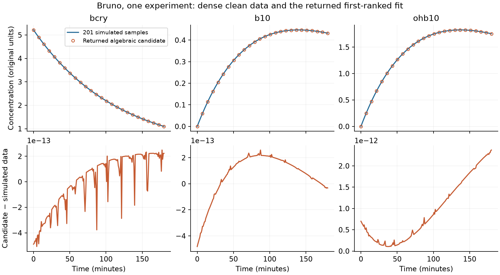

# Dense synthetic single-experiment checks

This study starts with two systems and removes sparse sampling, noise, and joint
experiment construction from the question. It uses the normal ODEPE estimator
and the existing benchmark configuration. The original PEtab experimental-data
results remain separate.

Initial core implementation: `7e926a7`. Julia: 1.13.0. Canonical benchmark checkout:
`ddaa86d13f708926c57ec8918ce75a6b50e2e562`. Reproduction commands and compact
evidence are in [`repro/petab/dense_single/`](../repro/petab/dense_single/README.md).

The [symbolic-system anatomy follow-up](2026-09-11_symbolic_system_anatomy.md)
explains the purpose of fraction GCD cancellation and gives verified Fujita
monomial counts and equations. It also distinguishes the saved template's
order-7 observation support from the full pool's additional order-8 rows.

## Experiment definition

| Setting | This study |
|---|---|
| Conditions | Bruno `model1_data4`; Fujita `condition_step_01_0` (EGF 1 ng/mL) |
| Data | 201 evenly spaced, clean samples per observable; 603 scalar observations per model |
| Time intervals | Bruno: 0–180 minutes; Fujita: 0–3600 seconds |
| Generating values | Published PEtab nominal values, used explicitly as synthetic truth |
| Estimator entry point | `analyze_parameter_estimation_problem` |
| Interpolators | All nine package defaults, with ordinary noise filtering; all nine survived for both data sets |
| Anchors | 20 points with exponential warp, beta 3 |
| Multipoint | Two points within this one experiment; at most 15 pairs |
| Solver | Parameterized HC; normal noise-frontier selection and power-of-two/column scaling |
| Polish | Algebraic root polish and bounded logarithmic least-squares trajectory polish; 5,000 iterations and 120 seconds per trajectory candidate |
| Simulation and trajectory tolerances | `abstol=reltol=1e-12`; default `AutoVern9(Rodas5P())` |
| Bounds | Published kinetic/observable parameter bounds; free nonnegative ICs with upper bound equal to the largest published parameter bound |
| Terminal rescue | Disabled, so a failure to obtain an algebraic candidate stays visible |
| Ranking | Normal fit-based ranking, `branch_detection=true`, `rank_strategy=:err_only`; no truth-based branch selection |
| UQ | Disabled |

This follows the retained PEB script in
[`repro/06_lost_recheck/lotka_volterra_2_1em2/script.jl`](../repro/06_lost_recheck/lotka_volterra_2_1em2/script.jl).
The changed data, physical bounds, shorter per-candidate polish limit, terminal
rescue setting, and profiling are recorded explicitly in each attempt. The
earlier PEtab block runner's two-interpolator/six-anchor settings are not used.
The nine methods are AGP robust SE/RQ, adaptive S3 SE/RQ, Chebyshev BIC/AICc,
AAA+GPR, AAA, and S2 AAA MLE.

The extractor removes only an invariant set of **symbolically known-zero**
initial states whose vector field vanishes when those states are zero. It then
removes states with no dependency path to an observable. Generating parameter
values are not used to decide this reduction. Every retained state initial value
is still an estimand, including original known zeros. Thus this is an ordinary
synthetic recovery problem, not the original constrained PEtab likelihood fit.

The dense simulation of the reduced condition must match a separately simulated
full imported condition. The tolerance is `1e-7` relative to each signal's maximum
absolute value. Bruno's largest discrepancy was `6.38e-13`; Fujita required no
state reduction and its two simulations agreed exactly.

## Bruno: successful recovery

The original seven-state condition reduces to three measured states. `bcar`
and `zea` remain exactly zero, and `bio`/`ohbio` cannot influence the observations.
The physical equations are

```text
bcry'  = -(kc1 + kc2) * bcry
b10'   = kc1 * bcry - kb2 * b10
ohb10' = kc2 * bcry - kc4 * ohb10
observations = [bcry, b10, ohb10]
```

There are four unknown rates and three unknown ICs. The normal returned
first-ranked result was a single-point AAA algebraic candidate from the anchor
at 36 minutes. It required no representative fixing or trajectory polish.
The reported states below are ICs at physical time zero; the anchor is provenance.

| Quantity | Generating truth | Returned estimate | Recovery error |
|---|---:|---:|---:|
| `kb2` | 0.005843831819271 | 0.005843831819290138 | `3.27e-12` relative |
| `kc1` | 0.001678825242274 | 0.001678825242277590 | `2.14e-12` relative |
| `kc2` | 0.006975989070463 | 0.006975989070457764 | `7.51e-13` relative |
| `kc4` | 0.006082700899195 | 0.006082700899175135 | `3.27e-12` relative |
| `bcry(0)` | 5.21693865661801 | 5.216938656617521 | `4.88e-13` absolute |
| `b10(0)` | 0 | `-4.82e-13` | `4.82e-13` absolute |
| `ohb10(0)` | 0 | `7.00e-13` | `7.00e-13` absolute |

The package fit score was `9.46e-23`. An independent SciPy matrix-exponential
evaluation of the physical ODE verified the returned candidate against the
retained data: maximum relative signal error `1.30e-12`. This independent check
does not optimize, interpolate, or call Julia.



The selected systems were small:

| Construction | Equations / solve variables | Data coefficients | Highest observed derivative | Mixed volume |
|---|---:|---:|---:|---:|
| Single point | 14 / 14 | 9 | 2 | 1 |
| Two points | 24 / 24 | 12 | 1 | 1 |

Solve-variable counts include auxiliary state jets; they are not the number of
physical rates and ICs. Both generic starts had one solution. A single generic
start per construction was reused across all nine interpolators. The search
visited 180 single-point anchors and 135 pairs and returned 429 candidates before
final clustering/ranking; automatic multiplicity was 1.

The estimator call took 343.8 seconds. Its structured core timing covered 261.7
seconds: setup 4.1 s, SI/SIAN template 67.3 s, equation construction/solving 113.8 s,
result processing 25.2 s, aggregation 16.0 s, trajectory polish 13.7 s, and branch
completion 21.6 s. The remainder includes work outside that timing envelope,
including compilation and analysis/reporting. These are cold, instrumented times,
not steady-state throughput. Nested detailed timings must not be added to parent
phase times; concurrent candidate-polish durations can also overlap.

## Fujita: symbolic setup investigation

The condition retains nine states, thirteen kinetic/turnover parameters, and
three observable scales. Its nine free initial states give 25 physical unknowns.
The generating parameters and initial states, including the wide range of
physical magnitudes, are retained with the synthetic data.

The first SIAN construction produced 88 equations over 87 non-data indeterminates
and selected 85 independent equations. These are construction counts before the
normal data-variable accounting and noise-frontier selection; they are **not**
an 85-variable square HC system. The raw SIAN derivative dictionary contains
orders through 26, so the support structure was extended to that order. This
bookkeeping does not mean that 26th derivatives were evaluated from the data.

The structural analysis selected two representative parameters,
`reaction_5_k1=1` and `EGFR_turnover=1` in the internally rescaled system, and
started the final template pass. The profiles distinguish identifiable-function
simplification from the later multiplicity computation. The latter enters
`_multiplicity_via_identifiable_projection` and `_eliminate_to`, which call
Gröbner elimination before the estimator reaches interpolation and HC.

SI also warned that a Wronskian corank limits its global-identifiability verdict
to multiple experiments. The recorded representative selection is what the
current pipeline did, not a claim that this run certified single-experiment
identifiability. That distinction needs checking when revisiting the preflight.

The first attempt **failed, rather than timing out**. Template construction
finished in 706.8 seconds according to the core's `@timed` measurement.
Multiplicity was 1: the initial Gröbner call took 13.06 seconds and the following
quotient-basis/elimination stage took 516.16 seconds, on 88 ring variables and 89
polynomials. The supervisor recorded 959.3 seconds for the entire worker,
including package loading. No HC path tracking was reached.

The immediate failure was an ODEPE bug: generic template instantiation evaluated
the entire SIAN derivative dictionary through order 26 and asked TaylorDiff for
order 21, beyond the supported limit of 20. The saved equations actually use
observed derivatives only through orders 6, 7, and 7 for the three observables.
No 21st derivative occurs in those equations.

`instantiate_si_template_equations` now derives its required orders from the
actual symbolic support and skips every absent observable jet. A new core
regression reproduces a 26-order bookkeeping dictionary with a first-order
template, and verifies that a truly required unsupported derivative still fails.
This does not raise a derivative cap or change the selected equations.

The fix is `5b485e0`. Its focused core contracts passed 448/448, including the
four new assertions. The full Julia 1.13 gate passed **1,817/1,817** in 16m35.2s.

The [rerun on that fix](../repro/petab/dense_single/evidence/fujita_201_fixed.json)
used byte-identical synthetic data and the same estimator settings. It passed
the failed instantiation stage, then **timed out during mixed-volume computation
for a candidate basis**, before any HC root tracking. The interrupt stack is
`_noise_select_pool → _noise_candidate_from_indices → _noise_mixed_volume →
HomotopyContinuation.mixed_volume → MixedSubdivisions.next_cell!`. No completed
mixed-volume value, generic start, or algebraic estimate was obtained.

The rerun's SI template phase took 738.8 seconds. Its multiplicity calculation
again returned 1, with 10.70 seconds in the initial Gröbner call and 549.22 seconds
in quotient-basis/elimination. After representative fixing the template diagnostic
reports 85 equations and 85 non-data unknowns; the 81 supported data symbols
include unused jets. The final noise-frontier candidate report was never emitted,
so this is a template size, not a recorded selected-system size.

The external limit was 1,200 seconds from entry to the estimator, including
compilation and symbolic setup. The supervisor recorded 1,200.3 seconds at
interruption; the worker's monotonic estimation counter recorded 1,131.0 seconds.
Those distinct clock readings are preserved in the evidence rather than combined
into an inferred HC solve time. Completed detailed operation records and the
interrupt stack survive, although the aggregate timing result is only installed
when the estimator returns normally.

## Sneyd: isolate denominator processing

This is a construction-only probe of one condition, `Ca_dose_response__1`, using
the same rescaled block expression as the previous investigation. It does not
add a third estimation campaign. For the observable
`(0.9*IPR_A + 0.1*IPR_O)^4`, measurements were:

| Operation | Elapsed time | Allocated bytes |
|---|---:|---:|
| Form first Lie derivative | 0.267 s | 14,550,976 |
| Flatten its fractions without polynomial GCD | 0.00095 s | 167,464 |
| Form second Lie derivative | 0.0435 s | 1,490,752 |
| Flatten its fractions without polynomial GCD | 0.0240 s | 757,848 |
| Existing `clear_denoms` on the second derivative | Still running at the external 180.8 s cutoff | Not available for unfinished call |

Both flattened derivatives agreed with their original expressions at five
positive parameter/state probes; the largest relative evaluation discrepancy
was `1.02e-15`. The second derivative's printed expression grew from 5,902 to
13,875 characters after flattening. Character counts describe representation
size, not expanded monomial counts or polynomial degree.

Immediate signal stacks captured conversion/expansion into polynomials, followed
by `safe_gcd`. The final retained sample contained 3,044 snapshots, all inside
the `clear_denoms → simplify_fractions → simplify_div → safe_gcd` stack, including
GCD compilation. This is direct evidence of where the time went, not an inference
from an undifferentiated model timeout. The flattened representation is promising
for preprocessing, but its polynomial degrees, extra pole roots, and HC cost
still need checking before changing production denominator handling.

## Instrumentation used and follow-up

The existing repo facilities are substantial and directly useful here:

- [`optimized_multishot_estimation.jl`](../src/core/optimized_multishot_estimation.jl):
  timing capture/serialization, phase allocation/GC/RSS reporting, interpolation,
  single-point and multipoint construction/solve timing, and generic-start reuse.
- [`run_context.jl`](../src/core/run_context.jl) and
  [`si_template_integration.jl`](../src/core/si_template_integration.jl):
  per-run detailed sinks and nested operation timings.
- [`logging_utils.jl`](../src/core/logging_utils.jl): timestamped phase heartbeats.
- [`noise_frontier_construction.jl`](../src/core/noise_frontier_construction.jl):
  Jacobian compilation, differentiation, rank, and basis-selection diagnostics.
- [`si_equation_builder.jl`](../src/core/si_equation_builder.jl):
  SIAN phase timings, variable roles, rank reduction, and multiplicity timings.
- Existing profiling examples include
  [`repro/receptor_breakdown_2026_05_27/`](../repro/receptor_breakdown_2026_05_27/)
  and [`repro/hc_threading_mwe_2026_07_22/`](../repro/hc_threading_mwe_2026_07_22/).

Completed-phase timing alone cannot explain an unfinished phase. Julia sampling
profiles and immediate signal stacks fill that gap. The harness retains both;
profile excerpts in the compact evidence use inclusive, overlapping stack counts.

The next focused changes should be driven by these observations: retain Bruno
as a successful control, address Fujita's expensive symbolic preflight and
mixed-volume scoring during basis selection, and test fraction flattening/preserved
rational structure before committing to a new denominator-clearing policy.
Fujita needs diagnostics before each mixed-volume call so an unfinished candidate
still leaves its dimensions and support available. More interpolation methods,
more data, or a longer HC tracking limit cannot fix a delay that occurs before
those stages begin.

The implementation change is confined to the template-instantiation helper and
its regression test. Validation also includes the two dense simulation parity
checks, Bruno recovery and its independent exact-ODE check, Sneyd's derivative
equivalence probes, Python syntax checks, and parsing the Julia harness scripts.
The full package gate passed 1,817/1,817; the focused core contracts passed
448/448. Commands, durations, and log hashes are retained in
[`validation.json`](../repro/petab/dense_single/evidence/validation.json).
Both active environment manifests retained their pre-study SHA-256 hashes.
