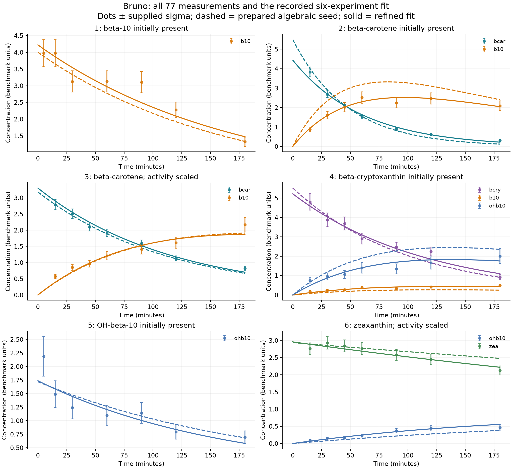

# Bruno explained and derivative-cap follow-up

This follows the [bounded experiment trial](2026-09-11_petab_experiment_blocks.md).
The new estimation runs change the explicit derivative cap from four to ten;
their starts, benchmark revision, dependencies, two GP methods, six shooting
anchors, and requested 900-second budget match the earlier protocol. The API
now accepts caps 0–10; the default remains four. The old `max_deriv_level=10`
still visible in `solve_parameter_estimation` belongs to an unsupported legacy
entry point, not a current global setting.

The retained [cap-10 results](../repro/petab/derivative10_results/summary.md)
include every new estimation attempt. Original pilot/block results are unchanged.

## What the recovery check measures

[`test/benchmark_smoke.jl`](../test/benchmark_smoke.jl) generates synthetic
observations from known parameters and runs the estimator. It checks whether at
least one returned parameter branch recovers the generating values. Its metric is

\[
\min_{c\in\text{returned clusters}}\max_j
\frac{|\hat p_{cj}-p_j^{\rm true}|}{\max(|p_j^{\rm true}|,10^{-12})}.
\]

Thus “recovery errors” are numerical discrepancies, not software/test failures.
This particular metric measures parameters, not initial-state error, and uses
the known truth to pick the best branch. It does not demonstrate that fit-based
ranking always selects that branch. Ten assertions cover four model/settings
combinations, each with 201 observation times per signal:

| Case | Last recorded recovery error |
|---|---:|
| Lotka–Volterra, tiny additive noise, polish | 5.62862445790957e-5 |
| Simple model, tiny additive noise, polish | 6.350909659280646e-9 |
| Lotka–Volterra, clean, no polish | 1.0168680712278426e-10 |
| HIV, clean, rescaling and polish | 2.4963073830264193e-9 |

The first value means a worst-parameter discrepancy of approximately 0.00563%
in the best returned branch. The two noisy cases use noise level 1e-8, with
additive standard deviation scaled by the signal's mean absolute clean value.
These are regression guards on comparatively dense, clean data, not evidence
that sparse experimental PEtab problems should be equally easy. These recovery
numbers were recorded before this cap-only follow-up; recovery was not rerun here.

## Bruno's actual problem

The benchmark concerns carotenoid cleavage by the Arabidopsis enzyme AtCCD4.
The [original paper](https://academic.oup.com/jxb/article/67/21/5993/2738937)
models the decay of carotenoids into smaller products. The seven SBML states are:

| State ID | Meaning |
|---|---|
| `bcar` | beta-carotene |
| `bcry` | beta-cryptoxanthin |
| `b10` | beta-apo-10-carotenal |
| `bio` | beta-ionone |
| `ohb10` | 3-OH-beta-apo-10-carotenal |
| `ohbio` | 3-OH-beta-ionone |
| `zea` | zeaxanthin |

There are six reaction channels, with condition-specific multipliers:

```
bcar  --kb1--> b10 + bio
b10   --kb2--> bio
bcry  --kc1--> b10 + ohbio
bcry  --kc2--> ohb10 + bio
ohb10 --kc4--> ohbio
zea   --k5-->  ohb10 + ohbio
```

These are the reactions represented in the SBML, not a claim that the listed
species include every chemical product. If `b = bcar`, `c = bcry`, `a = b10`,
`h = ohb10`, `z = zea`, and `q_j` denotes the rate after applying the condition's
multiplier, the five upstream equations are

\[
\dot b=-q_{b1}b,\quad \dot c=-(q_{c1}+q_{c2})c,\quad \dot z=-q_5z,
\]
\[
\dot a=q_{b1}b+q_{c1}c-q_{b2}a,\qquad
\dot h=q_{c2}c+q_5z-q_{c4}h.
\]

The two product states accumulate the corresponding reaction fluxes and do not
feed back. For fixed rates the ODE is linear in states. The inverse problem is
nonlinear because rates multiply states, and `szea` multiplies rates.

There are **13 fitted PEtab parameters**: six rate constants, the common activity
factor `szea`, and six experimental starting concentrations. All are optimized in
log10 coordinates, with physical bounds 1e-5 to 1000. `szea` accounts for activity
differences between datasets, rather than an estimated exponent or noise level.

| Experiment | Initially present; other states start at zero | Observed states | Rows |
|---|---|---|---:|
| 1 | b10 | b10 | 7 |
| 2 | bcar | bcar, b10 | 14 |
| 3 | bcar; reaction rates multiplied by szea | bcar, b10 | 14 |
| 4 | bcry | bcry, b10, ohb10 | 21 |
| 5 | ohb10 | ohb10 | 7 |
| 6 | zea; active rates multiplied by szea | zea, ohb10 | 14 |

This is **77 rows, 11 trajectories, seven times per trajectory**, with no repeated
condition/observable/time triples in the PEtab table. Experiments 1 and 5 use
5, 15, 30, 60, 90, 120, 180 minutes; the others use
15, 30, 45, 60, 90, 120, 180 minutes. The original paper explains that modeled
data are replicate means (three or four repeats), with estimated standard errors;
the benchmark supplies one value and one fixed noise standard deviation per row.
Those standard deviations range from 0.023108 to 0.43054. They are not additional
fitted parameters in this PEtab problem. The GP seed stage currently does not use
the individual PEtab row noise weights; scoring and refinement do.



Dashed curves use the prepared algebraic parameter seed; solid curves use the
refined vector. Error bars show the supplied row standard deviation. The
[CSV](../repro/petab/bruno_explained/measurements_and_predictions.csv) contains all
77 measurements, sigmas, predictions, and squared standardized residuals.
The [PDF](../repro/petab/bruno_explained/bruno_fits.pdf) is available for export.

## What the algebraic candidate actually contains

In the six-condition run the constructor retains 14 local anchor states and
seven shared kinetic/activity parameters: **21 algebraic unknowns**. The six
initial-concentration parameters are subsequently recovered by preparation
projection; they are not six extra unknowns in this polynomial system.

Each of the 11 observed signals supplies an interpolated value and first
derivative at one anchor: 22 candidate equations. The rank selector retains 21.
For example, condition 2 contributes

\[
b_2-y_b=0,\quad a_2-y_a=0,\quad
-k_{b1}b_2-y'_b=0,\quad k_{b1}b_2-k_{b2}a_2-y'_a=0.
\]

The corresponding condition-3 equations use its own state variables and the same
rates, multiplied by `szea`. Here the y values and derivatives are numerical
coefficients supplied by the interpolant; they are not extra solve unknowns.
This explains the cubic terms `szea * kb1 * bcar`. The actual selected system
contains 11 linear, seven quadratic, and three cubic equations, with 50 monomial
terms in total. Its equations and all name/scaling mappings are retained in
[`Bruno_JExpBot2016.system6.json`](../repro/petab/derivative10_results/Bruno_JExpBot2016.system6.json).

The two GP kernels and six anchor positions produced 12 returned roots across
12 separate systems; this does not mean one system has 12 algebraic solutions.
The best prepared seed came from candidate 7, the rational-quadratic GP, at
40 minutes in experiments 1/5 and 48 minutes in the others. All 13 physical
parameter values are shown below. The reference column is the benchmark's
published parameter vector, not a known ground truth and not a fitting start.

| Parameter | Prepared raw seed | Refined | Benchmark reference |
|---|---:|---:|---:|
| init_b10_1 | 4.002623 | 4.222150 | 4.222290 |
| init_bcar1 | 5.500871 | 4.440205 | 4.440296 |
| init_bcar2 | 3.180598 | 3.301699 | 3.301720 |
| init_bcry_1 | 5.515610 | 5.216808 | 5.216939 |
| init_ohb10_1 | 1.719605 | 1.737070 | 1.737247 |
| init_zea_1 | 2.937060 | 2.958112 | 2.958123 |
| k5 | 0.002295059 | 0.003086715 | 0.003086673 |
| kb1 | 0.021177250 | 0.016628472 | 0.016628410 |
| kb2 | 0.006106885 | 0.005843460 | 0.005843832 |
| kc1 | 0.001049482 | 0.001678799 | 0.001678825 |
| kc2 | 0.008957136 | 0.006975762 | 0.006975989 |
| kc4 | 0.005122591 | 0.006081356 | 0.006082701 |
| szea | 0.410610157 | 0.516831344 | 0.516831766 |

The actual root's state values need separate inspection:

| Experiment | State | Anchor (min) | Algebraic root | Prepared seed trajectory at same time |
|---|---|---:|---:|---:|
| 1 | bcry | 40 | 8.696565 | 0 |
| 1 | b10 | 40 | 3.465660 | 3.135142 |
| 2 | bcar | 48 | 1.990525 | 1.990525 |
| 2 | b10 | 48 | 2.186387 | 2.968834 |
| 3 | bcry | 48 | -8.716022 | 0 |
| 3 | bcar | 48 | 2.095266 | 2.095266 |
| 3 | b10 | 48 | 1.042984 | 1.018295 |
| 4 | zea | 48 | -7.397158 | 0 |
| 4 | ohb10 | 48 | 1.102425 | 1.653123 |
| 4 | bcry | 48 | 3.411884 | 3.411884 |
| 4 | b10 | 48 | 0.281934 | 0.189013 |
| 5 | ohb10 | 40 | 1.401007 | 1.401007 |
| 6 | zea | 48 | 2.807165 | 2.807165 |
| 6 | ohb10 | 48 | 0.193225 | 0.123506 |

The constructor relaxes local states at the anchors. It currently omits only
states outside the observation dependency closure, so it retains bcry in
conditions 1/3 and zea in condition 4 even though the prescribed zero initial
values and their homogeneous decay equations force them to remain zero.
This root is therefore not a physically valid full benchmark trajectory.
Its unweighted initial-preparation residual is 16.260876, not approximately zero.

The adapter back-integrates the retained state blocks, obtains the six unknown
starting concentrations from the initial maps, and restores all prescribed
initial conditions when simulating the PEtab problem. The reported raw NLLH
belongs to that prepared 13-parameter seed. It is not a likelihood computed
directly on the relaxed state trajectory. “Valid seed” means that projection,
bounds, rational-root checks, and full likelihood evaluation succeeded; it does
not mean that the root obeyed every original preparation constraint.
Enforcing these known constraints earlier is a concrete remaining improvement.

## Likelihood and its negative value

For independent normal measurement noise, with predictions mu_i(theta),

\[
L(\theta)=\prod_{i=1}^{77}\frac{1}{\sqrt{2\pi}\sigma_i}
\exp\left[-\frac{(y_i-\mu_i(\theta))^2}{2\sigma_i^2}\right].
\]

The minimized quantity is negative log-likelihood (NLLH), not likelihood:

\[
-\log L(\theta)=\underbrace{\sum_i\log(\sqrt{2\pi}\sigma_i)}_{-79.2438944856}
+\frac12\underbrace{\sum_i\left(\frac{y_i-\mu_i(\theta)}{\sigma_i}\right)^2}_{\chi^2(\theta)}.
\]

Likelihood is a product of probability densities. A density can exceed one:
a normal density with sigma=0.1 has value about 3.989 at its mean, giving NLLH
about -1.384 for that observation. Thus a negative NLLH is ordinary; its absolute
zero depends on units and density normalization. For this fixed-noise benchmark,
minimizing NLLH is exactly equivalent to minimizing weighted squared error.

| Vector | NLLH | Weighted squared error chi-square | RMS residual in supplied sigma units |
|---|---:|---:|---:|
| Original random start | 7,849,332.1121 | 15,698,822.7119 | 451.532 |
| Six-experiment prepared raw seed | 51.5643917 | 261.6165724 | 1.843 |
| Refined seed | -46.6881798 | 65.1114295 | 0.920 |
| Benchmark reference | -46.6881814 | 65.1114261 | 0.920 |
| Earlier Julia/Fides single start | 874.2012463 | 1,906.8902815 | 4.976 |
| Earlier AMICI/Fides single start | 874.2012372 | 1,906.8902633 | 4.976 |

`explain_bruno.py` reconstructs the linear-in-state ODE from the canonical SBML
and evaluates `exp(A*t)*x0`, independently of Julia/AMICI integration. It reproduces
the raw and refined scores within 3e-8 and all recorded scores within the stated
audit tolerances. [Full precision audit](../repro/petab/bruno_explained/audit.json).
The benchmark reference was evaluated only for this explanation, not used to
initialize or refine an estimate. Matching its objective is encouraging evidence
on Bruno; two earlier local-optimizer single starts are not a general comparison
of software performance.

## Higher derivative caps and polynomial sizes

With m observed signals and one anchor per condition, derivatives through d
provide at most m(d+1) observation equations. They need not be independent.
They are also not m(d+1) independently measured data: the higher derivatives
are inferred from the same finite noisy samples.

| Model / group | Shared algebraic parameters | Local states | Unknowns | Observed signals | Minimum d by equation count alone |
|---|---:|---:|---:|---:|---:|
| Bruno / 2 | 3 | 4 | 7 | 3 | 2 |
| Bruno / 4 | 7 | 11 | 18 | 8 | 2 (actual numerical rank needs 3) |
| Bruno / 6 | 7 | 14 | 21 | 11 | 1 |
| Fujita / 2 | 16 | 18 | 34 | 6 | 5 |
| Fujita / 4 | 16 | 36 | 52 | 12 | 4 |
| Sneyd / 2 | 14 | 12 | 26 | 2 | 12 |
| Sneyd / 4 | 14 | 24 | 38 | 4 | 9 |

Fujita has nine states per condition: EGFR, pEGFR, pEGFR_Akt, Akt, pAkt,
S6, pAkt_S6, pS6, EGF_EGFR. The canonical training problem has six step-input
conditions and 144 rows: three observed signals, eight times each, per condition.
Its full fitted vector has 19 entries: 13 kinetic/turnover parameters, three
observation scales, and three starting concentrations. The block algebra retains
the first 16 parameters and nine local states per experiment. The observables
are scaled pEGFR+pEGFR_Akt, pAkt+pAkt_S6, and pS6.

At cap ten, **Fujita / 2 reaches numerical rank 34/34 at order five**, selecting
34 equations out of 36. It proceeds through interpolation and then times out
constructing HC polyhedral start solutions, specifically MixedSubdivisions
`fine_mixed_cells`. Thus four was indeed too low for this relaxed two-condition
construction; raising it resolves that barrier, but not the subsequent solve cost.

The selected system's total degrees and term counts, treating data jets as
coefficients, are:

| Derivative order | Selected equations | Total degree | Monomial terms across these equations |
|---|---:|---:|---:|
| 0 | 6 | 2 | 16 |
| 1 | 6 | 3 | 18 |
| 2 | 6 | 5 | 48 |
| 3 | 6 | 7 | 166 |
| 4 | 6 | 9 | 602 |
| 5 | 4 | 11 | 1355 |
| All | 34 | maximum 11 | 2205 |

Its largest equation contains 478 monomial terms. Its loose total-degree Bezout
bound is 6.67331408368795401e23; this is not a measured root count or path count.
HC exploits sparse supports, but computing the sparse polyhedral starts itself
exceeds this run's budget. The degree/count diagnostics reconstruct the same
deterministic rank selection, without a second candidate search or mixed-volume
calculation. [Full system](../repro/petab/derivative10_results/Fujita_SciSignal2010.system2.json).

Reconstructing the four-condition system confirms that it stops at order four
even when permitted to go to ten. It has 52 selected equations out of 60, maximum
degree nine, and 861 monomial terms (largest equation: 98 terms). Its larger
variable count and smaller polynomial expressions represent a different tradeoff;
the earlier run also timed out constructing polyhedral starts. This follow-up
only measured that system, rather than repeating its unchanged solve.
[Full four-condition system](../repro/petab/derivative10_results/Fujita_SciSignal2010.system4.json).

| Selected system | Equations / unknowns | Highest observation derivative | Maximum polynomial degree | Total monomial terms |
|---|---:|---:|---:|---:|
| Bruno / 6 | 21 / 21 | 1 | 3 | 50 |
| Fujita / 2 | 34 / 34 | 5 | 11 | 2205 |
| Fujita / 4 | 52 / 52 | 4 | 9 | 861 |

Sneyd models six receptor-state occupancies/probabilities per condition:
IPR_O, IPR_R, IPR_I1, IPR_S, IPR_A, IPR_I2. The observable is
`(0.9*IPR_A + 0.1*IPR_O)^4`: the exponent is the fixed integer four, not a fitted
exponent. The canonical problem has nine conditions and 135 observations, 15
times per condition from 0 to 0.98 seconds. Fourteen fitted parameters enter the
ODE; the fifteenth, sigma, enters only the noise model.

Sneyd / 2 cannot form a square relaxed observation pool at cap ten: at most 22
equations for 26 unknowns. Sneyd / 4 has enough potential rows by order nine,
so it was also tested at cap ten. Both runs time out in SymbolicUtils rational
GCD simplification, called by `clear_denoms` while preparing the second-order
observation equations. Their last completed ranks are respectively 4/26 and
8/38 at order one. No square system or root count was obtained; reporting
polynomial degrees for a completed Sneyd solve would be misleading.

All three new estimation attempts terminate with status timeout, around 935
seconds including termination/cleanup versus the requested 900-second worker
budget. Workers overlap, so timings do not establish relative speed. No optimizer
refinement ran on these three attempts. These finite-cap/rank/time observations
do not establish structural nonidentifiability.

This follow-up leaves the numerical/algebraic algorithms unchanged beyond the
accepted explicit cap. Known preparation/conservation constraints and cheaper
rational expression handling remain plausible next improvements. Increasing
order alone does not bypass either observed symbolic/HC bottleneck.

The Julia 1.13 full gate passed 1813/1813 (15m24.5s), optional PEtab contracts
passed 111/111, and the Python supervisor contracts passed 4/4. Environment and
artifact digests are recorded in the new trial directory's validation record.
